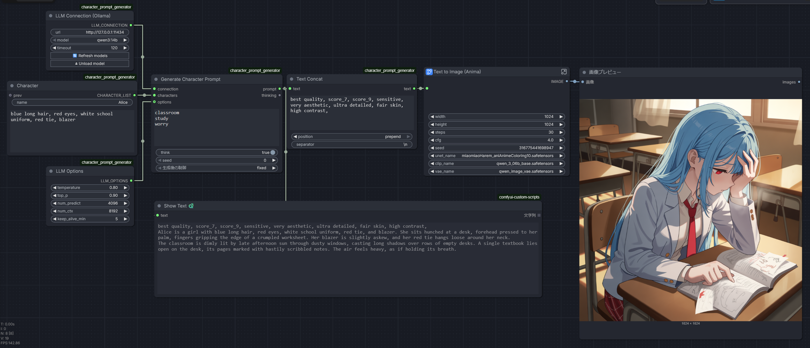
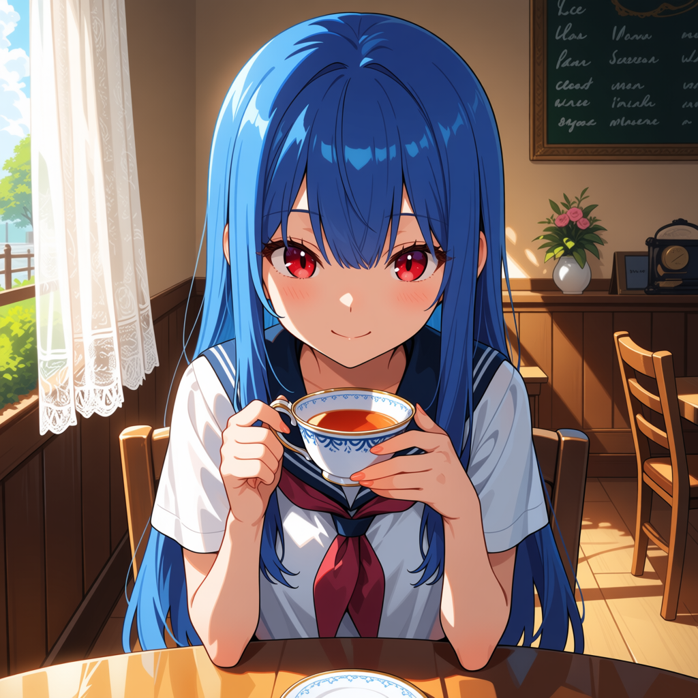
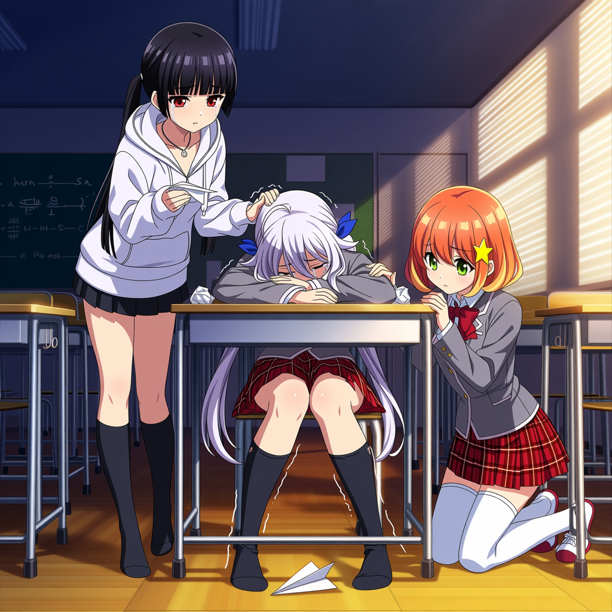

# ComfyUI Character Prompt Generator (for Anima)
> *Tired of manually writing detailed image prompts every single time?*

A ComfyUI custom node that uses a local LLM (Ollama) to build image generation prompts tailored for Anima based on character settings and scene descriptions.

## Features

- **Anima-Oriented Prompts**: Generates prompt structures and tag formats optimized for Anima.
- **Multilingual Input**: Accepts Japanese or English inputs for scene descriptions and attributes (processed via LLM).
- **Two-Part Prompt Architecture**: Divides output into explicit "Character Attributes" and "Scene Composition" sections, preventing attribute bleed and maintaining structural clarity for Anima.
- **Smart Detail Expansion**: Fleshes out minimal scene inputs (e.g., just "school") into rich environmental and narrative details without overriding specified attributes.

## Example

**Input:**
- **Character:** `name: Alice`, `attributes: blue long hair, red eyes, white school uniform`
- **Scene:** `school`

**Output:**
> Alice is a girl with blue long hair, red eyes, and a white school uniform. She is looking intently at a textbook on her desk, her brow slightly furrowed in concentration. Her hands hold the book with one hand and a pencil with the other. She is seated in the center of a classroom.
> The scene takes place in a bright, orderly classroom with wooden desks and chairs arranged in rows. A chalkboard covers one wall, and sunlight streams through tall windows with white curtains. A clock on the wall shows midday.

## Requirements

- A local instance of [Ollama](https://ollama.com/) running.
- **Recommended Models**: Models supporting reasoning/thinking (e.g., `qwen3:14b`).

## Installation & Usage

1. Place this repository into your `ComfyUI/custom_nodes/` directory and restart ComfyUI.
2. Connect the nodes as follows:
   - **LLM Connection (Ollama)**: Select your target model. (If the dropdown is empty, ensure Ollama is running and click `🔄 Refresh models`).
   - **Character**: Input `name` and `attributes`. For multiple characters, chain additional Character nodes via the `prev` slot.
   - **Generate Character Prompt**: Enter the scene description in `scene`.
   - **Output (`prompt`)**: Connect the output to text encoding nodes (e.g., CLIP Text Encode).
3. To keep the same prompt while re-rolling the image generation (e.g. fixing the prompt and varying only Anima's seed), set `seed` on the **Generate Character Prompt** node to `fixed` — the cached prompt is reused without calling the LLM again.

## Troubleshooting

| Issue / Setting | Cause & Solution |
| :--- | :--- |
| **Output `prompt` is empty** | The thinking process ran too long. Increase `num_predict` in `LLM Options` or turn off `think`. |
| **Errors related to `think`** | The selected model does not support thinking features. Set `think` to off. |
| **Out of VRAM** | Click the `⏏ Unload model` button on the node to instantly unload the LLM from VRAM. |
| **Colors/Outfits bleed or missing elements** | Prompt separation is handled at the LLM level, but model-side generation luck can still cause overlaps. Adjust the `attributes` text or re-roll the generation. |

## License

[MIT](LICENSE)